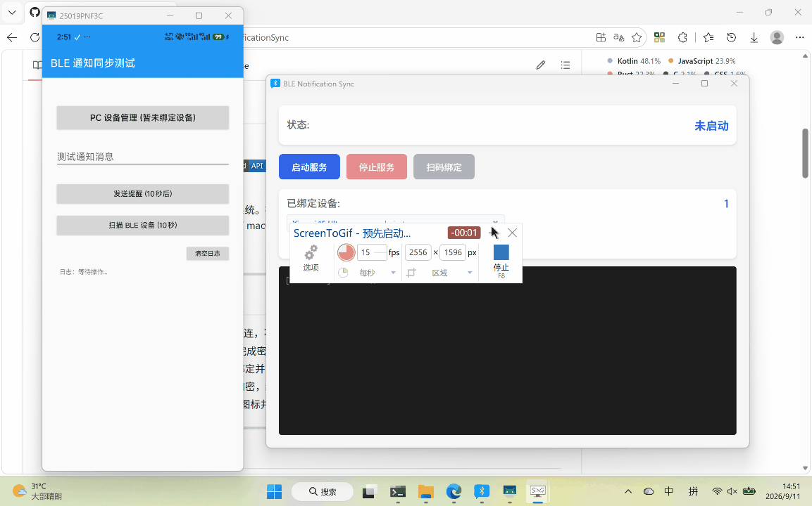

# BleNotificationSync

[简体中文](README.md) | **English**


A cross-platform notification sync system based on BLE (Bluetooth Low Energy). It pushes Android notifications (such as alarms and reminders) to desktop systems (Windows / macOS / Linux) in near-field, real-time fashion — with no internet, no account, and no cloud server involved.

<p align="center">
  
</p>

---

## Features

- **Purely local transmission**: Direct connection over BLE GATT, with no dependency on the internet or cloud servers.
- **No system-level Bluetooth pairing**: Key negotiation is done through QR code scanning, so there is no need to manually pair devices in the OS Bluetooth settings.
- **Multi-device association**: The Android client can bind and manage multiple desktop devices simultaneously.
- **End-to-end encryption**: AES-256-GCM authenticated encryption, with keys derived via HKDF-SHA256 and a random nonce generated per message.
- **Fragmented icon transfer**: During pairing, the app icon is automatically extracted, sliced, and transferred to the desktop for caching. Notification popups reuse the cached icon directly.

---

## Architecture

```text
Android Client (GATT Client)               Desktop Client (GATT Server)
[ App / SDK ]                             [ Tauri v2 / Rust Backend ]
     │                                                │
     ├── 1. Parse MAC / Service UUID from QR ──────────┤
     ├── 2. Initiate GATT connection (TRANSPORT_LE) ──┤
     ├── 3. Key negotiation (HKDF-SHA256) ────────────┤
     ├── 4. Transfer app icon binary slices ──────────┤
     └── 5. Push encrypted notification frames (AES-256-GCM) ─▶ └── Trigger native system toast
```

### Platforms & Tech Stack

| Module | Language / Framework | BLE Role | Status |
| :--- | :--- | :--- | :--- |
| **Android SDK** | Kotlin, C (LibTomCrypt JNI), API 23+ | GATT Client | Done |
| **Android Demo** | Kotlin, Jetpack Compose, Activity Result API | Host sample app | Done |
| **Desktop** | Rust, Tauri 2, HTML/JS | GATT Server (WinRT / BlueZ / CoreBluetooth) | Done |

---

## Transport Protocol & Security Specification

### GATT Service Definition

| Attribute | UUID |
| :--- | :--- |
| **Service UUID** | `364b0f2b-22f6-5997-4744-869ca4511d9e` |
| **Characteristic UUID** | `0000C3D4-0000-1000-8000-00805F9B34FB` |

### Frame Structure

Physical frame format (max 244 bytes per frame, matching the negotiated MTU):

```text
+-------------------+--------------+----------+--------------+------------------+
| Magic (2B, 0xAABB)| MsgType (1B) | Seq (1B) | TotalSeq (1B)| Payload (0-239B) |
+-------------------+--------------+----------+--------------+------------------+
```

### Message Types (MsgType)

| Value | Type | Direction | Description |
| :--- | :--- | :--- | :--- |
| `0x01` | **REGISTER** | Phone → PC | Registration: sends package name, app name, and random key material |
| `0x02` | **NOTIFY** | Phone → PC | Notification push: encrypted JSON containing title, body, and timestamp |
| `0x03` | **ACK** | PC → Phone | Acknowledgement |
| `0x04` | **ICON_DATA** | Phone → PC | Raw binary slices of the app icon |
| `0x05` | **ICON_END** | Phone → PC | Icon transfer completion marker |

### Cryptography

- **Symmetric encryption**: AES-256-GCM (16-byte auth tag, 12-byte random nonce).
- **Key derivation**: `baseKey = HKDF-SHA256(salt="BleNotificationSync", IKM=package_name + random_32B, info="")`.
- **Storage isolation**: On Android, keys are Base64-encoded and stored in `EncryptedSharedPreferences`; on desktop, the native secure storage is used (Windows Credential Manager / macOS Keychain / Secret Service).

---

## Getting Started

### 1. Build and Run the Desktop Client

Requirements: Node.js 18+, Rust 1.75+, and a C/C++ toolchain for your platform.

```bash
cd desktop
npm install
npx tauri dev
```

### 2. Integrate the Android SDK

#### Adding the Dependency

Add the SDK module or AAR in your project's `build.gradle.kts`:

```kotlin
dependencies {
    implementation(project(":sdk"))
    // Or use a prebuilt AAR:
    // implementation(files("releases/android/ble-notification-sdk.aar"))
}
```

##### Publishing to and Consuming from a Local Maven Repository (Recommended)

If you prefer to integrate or test the SDK independently, you can publish it to the local Maven cache (`~/.m2/repository/`):

1. **Publish to local Maven cache**:
   ```bash
   cd android
   ./gradlew publishToMavenLocal
   ```

2. **Reference it in your target project**:
   Add `mavenLocal()` in the target project's `settings.gradle.kts`:
   ```kotlin
   dependencyResolutionManagement {
       repositories {
           mavenLocal() // Check local Maven cache first
           google()
           mavenCentral()
           maven { url = uri("https://jitpack.io") }
       }
   }
   ```
   Then add the coordinate dependency in the target module's `build.gradle.kts`:
   ```kotlin
   dependencies {
       implementation("com.github.BladeFong:BleNotificationSync:master-SNAPSHOT")
   }
   ```

#### Usage Example

```kotlin
// 1. Initialize the SDK
val sdk = BleNotificationSDK.init(applicationContext)

// 2. Pair a PC device via QR code
sdk.startPairing(activity, "My App", object : PairingCallback {
    override fun onPaired() {
        // Pairing succeeded, key saved
    }
    override fun onError(error: SdkError) {
        // Error handling: SdkError.AlreadyPaired, SdkError.ScanFailed, etc.
    }
})

// 3. Push a notification to all paired PCs
//    Optional notificationId specifies a local notification ID;
//    if omitted, one is generated from title + body automatically.
sdk.sendNotification(
    title = "Meeting reminder",
    body = "The weekly project meeting starts in 10 minutes",
    // notificationId = 1001,  // Optional: specify an ID to cancel or update later
    callback = object : SendCallback {
        override fun onSuccess() { /* Push succeeded */ }
        override fun onError(error: String) { /* Error handling */ }
    }
)
```

---

## Development & Debugging Notes

1. **Windows notification limitations**:
   - Windows 10/11 toast notifications require the app to be associated with a valid `AppUserModelId`.
   - During `tauri dev`, if the system silently suppresses notifications, make sure the app has registered a shortcut. When installed via the official installer, this is handled automatically.
2. **Android permissions and GPS switch**:
   - Android 12+ (API 31+) requires the `BLUETOOTH_SCAN` and `BLUETOOTH_CONNECT` runtime permissions.
   - On some OEM systems (e.g. Xiaomi, Huawei, OPPO), turning off the system-wide GPS location switch causes BLE scanning to silently return zero results. Make sure location services are enabled before scanning.

---

## License

This project is licensed under the [Apache License 2.0](LICENSE).