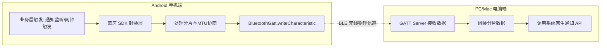

# BLE 近场通知同步方案文档 (原始提案)

> 本文档为项目初始提案，供背景参考。当前设计已演进，详见 `../superpowers/specs/2026-07-10-ble-notification-sync-design.md`。

## 与当前设计的主要差异

| 原始提案 | 当前设计 | 原因 |
|----------|----------|------|
| 前台 Service 保活 | 无保活，用完即断 | 简化架构，降低功耗 |
| AlarmManager 巡逻 | 闹钟触发时现场连接 | 避免不必要的后台活动 |
| SDK 封装闹钟 API | SDK 封装闹钟 + 通知 + 蓝牙推送 | 一体化调用更简洁 |
| Mode A + Mode B | 仅 Mode B | MVP 范围聚焦 |

---

# BLE 近场通知同步方案 (Android -> Windows/macOS)

## 1. 方案概述
本方案旨在通过低功耗蓝牙（BLE）建立手机与电脑的近场直连通道，实现**零云端、零账号、纯本地**的通知同步。
- **Android 端（GATT Client）**：作为数据发送方，监听系统通知或自身定时闹钟，通过蓝牙推送给电脑。
- **PC 端（GATT Server）**：Win10/11 与 macOS 作为数据接收方，持续广播蓝牙信号，接收手机数据后调用系统原生 API 弹出通知。

## 2. 系统架构流程



## 3. BLE 通信协议设计

为了保证跨平台兼容性与传输可靠性，自定义极简 GATT 协议：

- **Service UUID**: `0000A1B2-0000-1000-8000-00805F9B34FB` (自定义基础 UUID)
- **Characteristic UUID (Write)**: `0000C3D4-0000-1000-8000-00805F9B34FB`
  - 属性：`WRITE` 或 `WRITE_NO_RESPONSE`（优先使用 NO_RESPONSE 提升吞吐，应用层做校验）

### 数据分片协议
由于单次 BLE 写入受 MTU 限制（协商后可用约 244 字节），需定义简单分包协议：

| Header (2B) | Seq (1B) | TotalSeq (1B) | Payload (Max 240B) |
| :--- | :--- | :--- | :--- |
| `0xAA 0xBB` (固定包头) | 当前包序号 | 总包数 | JSON/文本数据的字节流 |

## 4. Android 端设计 (含 SDK 封装)

### 4.1 SDK 架构设计
将蓝牙底层通信完全封装，对外只暴露极简接口，解耦业务与传输：

```java
// 伪代码示例
public class BleClientSDK {
    // 1. 扫描与直连
    void connect(String macAddress, ConnectionCallback callback);
    // 2. 发送数据（内部自动处理 MTU 协商与分片组包）
    void sendData(byte[] data, SendCallback callback);
    // 3. 维持连接状态
    boolean isConnected();
}
```

**SDK 内部职责**：
- 连接成功后主动 `requestMtu(247)` 拉大传输窗口。
- 内部维护一个**串行发送队列**，确保前一个 GATT 操作完成后再发下一个，避免 `GATT_BUSY`。
- 实现断线指数退避重连。

### 4.2 业务层应用模式 (两种可选)
SDK 封装好后，业务层可灵活接入：

**模式 A：系统通知镜像（需要 `NotificationListenerService`）**
- 监听微信、短信等第三方通知。
- 在 `onNotificationPosted()` 中直接调用 `sdk.sendData(notificationText)`。
- *前提：必须由前台 Service 持有 SDK 实例，保持蓝牙长连接。*

**模式 B：自身定时闹钟（不需要监听权限）**
- 利用 `AlarmManager` 设定精确闹钟。
- 闹钟触发的瞬间，在同一个执行代码块里同时执行两件事：
  1. 调用本地 Notification 弹出手机通知。
  2. 调用 `sdk.sendData(alarmText)` 推送到电脑。
- *前提：依然需要前台 Service 提前建立并维持蓝牙连接，不可在闹钟触发时临时建连（耗时过长会被系统杀掉）。*

### 4.3 保活与自愈机制（核心）
只要依赖蓝牙长连接，就必须有保活机制：
- **前台 Service**：持有 SDK，显示常驻通知"同步服务运行中"。
- **AlarmManager 巡逻兵**：设置每 9 分钟一次的定时任务，检测 Service 存活与蓝牙连接状态，若断开则强制拉起或重连。

## 5. PC 端设计 (GATT Server)

PC 端需常驻后台，扮演 BLE 外设角色，接收数据并转化为系统通知。

### 5.1 Windows 端 (Win10 / Win11)
- **技术栈**：C# / .NET (WPF 或 WinForms 托盘程序) 或 C++ 调用 WinRT API。
- **GATT Server 实现**：
  - 使用 `Windows.Devices.Bluetooth.GenericAttributeProfile` 命名空间下的 `GattServiceProvider`。
  - 注册 `ValueChanged` 事件监听手机写入的数据。
  - 使用 `BluetoothLEAdvertisementPublisher` 持续广播 Service UUID。
- **通知展示**：使用 `ToastNotificationManager` 弹出 Windows 原生通知。

### 5.2 macOS 端
- **技术栈**：Swift / Objective-C (菜单栏常驻 App)。
- **GATT Server 实现**：
  - 使用 `CoreBluetooth` 框架的 `CBPeripheralManager`。
  - 启动后调用 `startAdvertising` 广播服务 UUID。
  - 在 `peripheralManager(_:didReceiveWrite:)` 回调中处理手机发来的数据包。
- **通知展示**：使用 `UserNotifications` 框架请求权限并弹出系统横幅。

## 6. 核心工程难点与应对

1. **GATT 操作串行化**：Android 蓝牙栈不支持并发 GATT 操作，SDK 必须封装单线程队列机制。
2. **后台执行限制**：Android 后台限制严苛，业务触发时不能临时建连。必须通过"前台 Service + 保活白名单"预热连接。
3. **PC 端睡眠状态**：电脑进入睡眠时 GATT Server 断开。手机 SDK 感知断线后不应疯狂重连，可结合系统唤醒事件重置连接。
4. **首次配对体验**：PC 端生成包含 MAC 地址的二维码，Android 端扫码后直传给 SDK，跳过缓慢的蓝牙扫描阶段，实现秒连。

## 7. 总结

本方案通过将 Android 蓝牙通信封装为独立 SDK，实现了底层传输与上层业务的解耦。结合 `AlarmManager` 或 `NotificationListenerService`，可灵活支持自有应用闹钟同步与全量系统通知镜像两种场景。PC 端采用原生 GATT Server 实现，保障了零账号、纯本地的隐私安全。该架构不仅适用于通知同步，底层链路也可直接复用于近场剪贴板同步、文件快传等其他场景。
