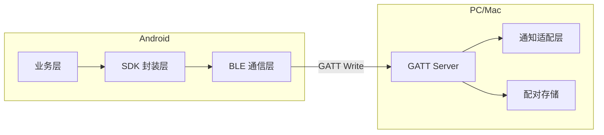
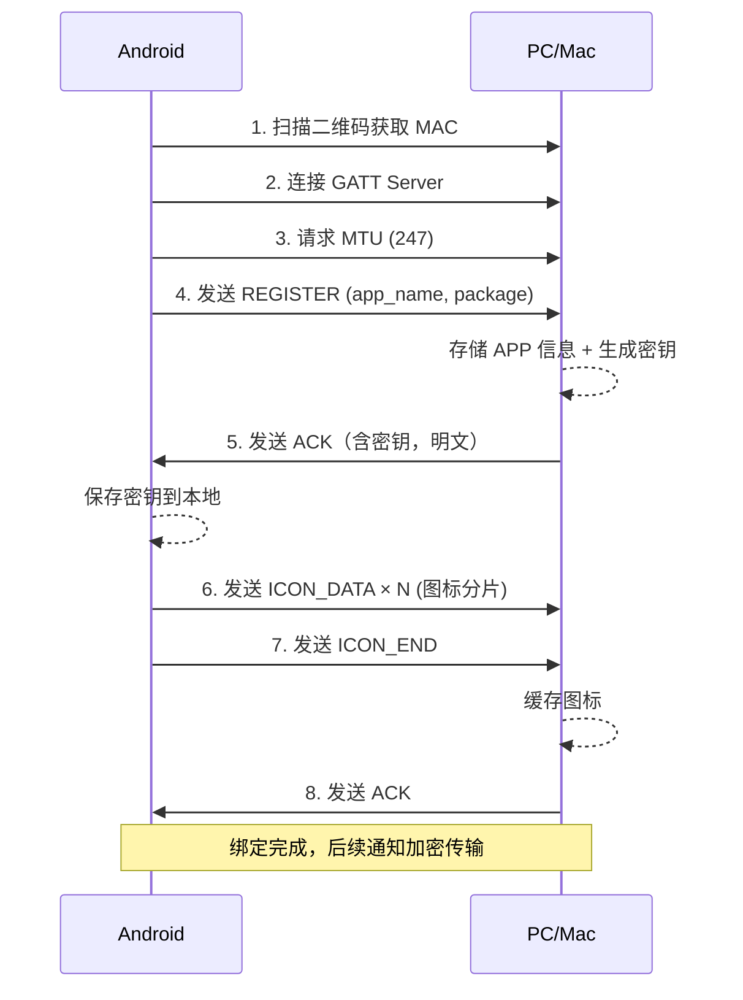
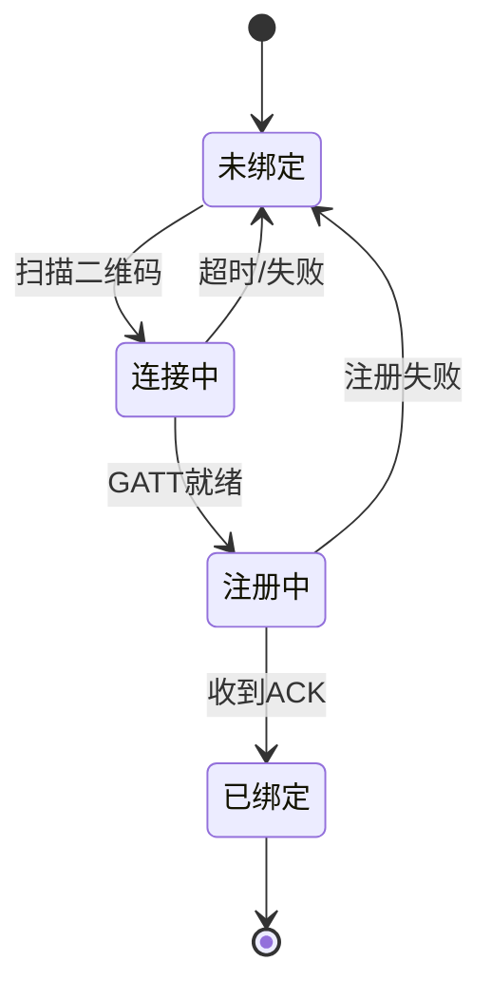
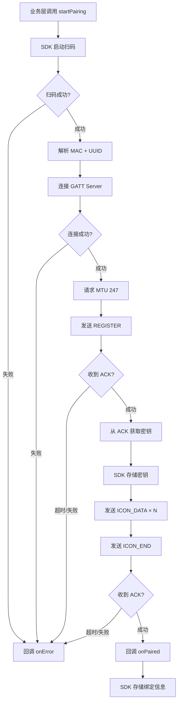
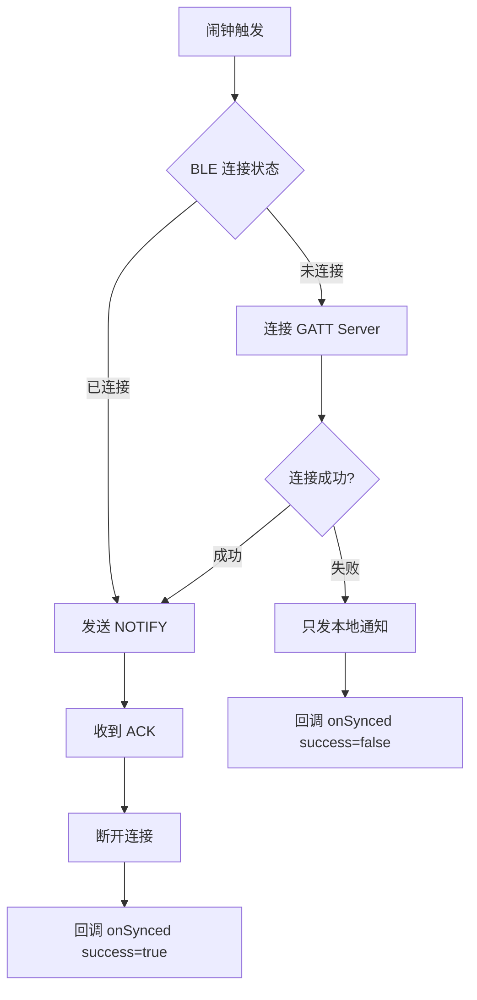

# BLE Notification Sync 设计文档

## 1. 项目概述

通过低功耗蓝牙（BLE）建立手机与电脑的近场直连通道，实现**零云端、零账号、纯本地**的闹钟通知同步。

- **Android 端（GATT Client）**：闹钟触发时推送通知到电脑
- **PC/Mac 端（GATT Server）**：接收数据后弹出系统原生通知

### 技术选型

| 平台 | 语言 | UI 框架 | 最低版本 |
|------|------|---------|----------|
| Android SDK | Kotlin | 无（纯 SDK） | API 23 (Android 6.0) |
| PC/Mac | Rust + Web | Tauri + HTML/JS | Windows 10 1709+ / macOS 13+ |

**Tauri 方案选择理由**：
- Windows 和 macOS 共享同一套 UI 和业务代码
- Web 技术栈（HTML/CSS/JS）开发效率高
- Rust 后端性能好、内存安全
- 包体积小（~5-10MB）
- 跨平台 BLE 通过平台特定 Rust binding 实现

**Android API 23 选择理由**：
- 覆盖 99.2% 活跃设备
- 避开 Camera2 早期 bug（API 21-22）
- 运行时权限模型成熟（相机、蓝牙权限更规范）
- BLE GATT / MTU 完整支持

---

## 2. 通信协议

### 2.1 GATT 服务定义

| 项目 | 值 |
|------|-----|
| Service UUID | `0000A1B2-0000-1000-8000-00805F9B34FB` |
| Write Characteristic | `0000C3D4-0000-1000-8000-00805F9B34FB` |
| 属性 | WRITE_NO_RESPONSE |

### 2.2 数据帧格式

```
+--------+--------+--------+--------+-------------------+
| Magic  | MsgType| Seq    |TotalSeq| Payload           |
| 2B     | 1B     | 1B     | 1B     | 0~240B            |
| 0xAA 0xBB|      |        |        |                   |
+--------+--------+--------+--------+-------------------+
```

- **Magic**: 固定包头 `0xAA 0xBB`
- **MsgType**: 消息类型
- **Seq**: 当前包序号（0-based）
- **TotalSeq**: 总包数
- **Payload**: JSON 数据的字节流

### 2.3 消息类型

| 值 | 名称 | 方向 | 说明 |
|----|------|------|------|
| 0x01 | REGISTER | Android→PC | 绑定时发送 APP 信息 |
| 0x02 | NOTIFY | Android→PC | 推送通知 |
| 0x03 | ACK | PC→Android | 确认收到 |
| 0x04 | ICON_DATA | Android→PC | 图标分片数据 |
| 0x05 | ICON_END | Android→PC | 图标传输完成 |

### 2.4 Payload 格式

#### REGISTER

```json
{
  "app_name": "JustNow",
  "package": "com.nearby.justnow",
  "random": "<base64 编码的 32 字节随机数>"
}
```

- `app_name`：APP 显示名称（来自 SDK 调用参数）
- `package`：Android 包名（来自 `context.packageName`）
- `random`：Android 生成的 32 字节随机数，base64 编码。用于密钥派生，双方各自 `HKDF(package+random) → baseKey` 后持久化

#### NOTIFY

```json
{
  "title": "任务提醒",
  "body": "会议还有10分钟",
  "package": "com.nearby.justnow",
  "timestamp": 1720000000000
}
```

#### ACK

```json
{
  "code": 0,
  "msg": "ok"
}
```

#### ICON_DATA

图标二进制直传（不做 Base64 编码），每片最大 239 字节。

**帧格式**：
```
+--------+--------+--------+--------+-------------------+
| Magic  | MsgType| Seq    |TotalSeq| IconData          |
| 2B     | 1B     | 1B     | 1B     | 0~239B            |
| 0xAA 0xBB|      |        |        | (原始二进制)       |
+--------+--------+--------+--------+-------------------+
```

**约束**：图标最大 60KB，确保 255 帧内完成传输。

#### ICON_END

```json
{
  "total_size": 12345
}
```

---

## 2.5 加密方案

### 2.5.1 加密库

| 平台 | 加密库 | 算法 |
|------|--------|------|
| Android | LibTomCrypt (JNI) | AES-GCM |
| PC/Mac | aes-gcm (Rust crate) | AES-GCM |

**选择 AES-GCM 的理由**：
- Rust 生态支持好（aes-gcm crate）
- AEAD 认证加密，与 AES-CCM 同等安全
- API 更简洁，易于跨平台一致

### 2.5.2 密钥管理

| 项目 | 说明 |
|------|------|
| 生成时机 | APP 绑定配对时 |
| 生成方式 | Android 生成 32 字节随机数，通过 REGISTER 帧发给桌面，双方各自 `HKDF(package+random) → baseKey` |
| 保存位置 | Android 端：SharedPreferences 存 `baseKey`<br>PC/Mac 端：按 MAC + 包名管理 |
| 随机数传递 | REGISTER 帧中明文携带，配对后丢弃 |

**密钥派生算法**（两端实现必须一致）：

```
// 配对时，一次性派生并持久化
random = SecureRandom.nextBytes(32)          // Android 生成
baseKey = HKDF-SHA256(
  salt = "BleNotificationSync",
  IKM  = packageName + random,               // 拼接包名和随机数
  info = "" (零长字节),
  L    = 32
)
// baseKey(32B) 持久化存储
```

**每次消息加密**（配对完成后不再派生新密钥）：

```
nonce = SecureRandom.nextBytes(12)          // 每次消息独立生成
ciphertext = AES-256-GCM-Encrypt(baseKey, nonce, plaintext)
发送: [Package(明文) | nonce(明文) | ciphertext]
```

**安全性**：
- 不同 pairing 的 random 不同 → baseKey 不同（防止反编译包名推算）
- 同一 baseKey 下每次消息 nonce 不同 → 密文不同（防重放攻击）
- 双层随机：配对级隔离 + 消息级隔离

### 2.5.3 通知加密流程

```
+------------------+                    +------------------+
|   Android 端     |                    |    PC/Mac 端     |
+------------------+                    +------------------+
| 1. plaintext = JSON 通知内容          |
|    (title, body, timestamp)          |
| 2. 生成随机数 nonce (8-13 字节)      |
| 3. ciphertext = AES-GCM-Encrypt(     |
|       key, nonce, plaintext)         |
| 4. 发送: [package | nonce | ciphertext]|
|    (package 明文，其余加密)           |
|         --------BLE--------->        |
|                                      | 5. 获取连接设备 MAC |
|                                      | 6. 解析 Package 明文|
|                                      | 7. MAC + Package   |
|                                      |    → 查找密钥       |
|                                      | 8. plaintext =     |
|                                      |    AES-GCM-Decrypt |
|                                      |    (key, nonce,    |
|                                      |     ciphertext)    |
+------------------+                    +------------------+
```

**安全说明**：Package 明文暴露不影响安全，因为没有密钥无法解密通知内容。

### 2.5.4 数据帧格式（加密后）

```
+--------+--------+--------+--------+---------+---------+-----------+
| Magic  | MsgType| Seq    |TotalSeq| Package | Nonce   | Ciphertext
| 2B     | 1B     | 1B     | 1B     | 变长    | 8~13B   | 变长
| 0xAA 0xBB|      |        |        | (明文)  | (明文)  |
+--------+--------+--------+--------+---------+---------+-----------+
```

**设计说明**：
- **Package**：APP 包名，明文传输，用于 GATT Server 查找对应密钥
- **Nonce**：随机数，明文传输，用于 AES-GCM 解密
- **Ciphertext**：加密的 JSON 通知内容（title、body、timestamp 等）

**解密逻辑**：
1. GATT Server 解析出 Package（明文）
2. 用连接设备 MAC + Package 查找密钥
3. 用密钥 + Nonce 解密 Ciphertext

### 2.5.5 绑定流程（加密版）

```
Android                                       PC/Mac
   |                                             |
   | 1. 生成 32B 随机数 random                   |
   | 2. REGISTER({app_name, package, random})    |
   | ----------------------------------------->  |
   |                                             | 3. baseKey = HKDF(package + random)
   |                                             | 4. 存储: MAC→(package, app_name, baseKey)
   | 5. ACK({code: 0})                          |
   | <-----------------------------------------  |
   | 6. baseKey = HKDF(package + random)         |
   | 7. 存储: package→(MAC, appName, baseKey)    |
   |                                             |
   | 8. 后续通知 AES-256-GCM(baseKey, nonce, pt) |
   | ==========================================>  |
```

**关键**：配对后双方持久化同一个 `baseKey`，后续消息直接用，不再每次派生。

### 2.5.6 安全考虑

| 场景 | 处理 |
|------|------|
| 重放攻击 | nonce 随机生成，每次不同 |
| 中间人攻击 | BLE 近场限制 + QR 码绑定 |
| 未绑定设备 | GATT Server 拒绝解密 |
| Package 明文暴露 | 无影响，需密钥才能解密内容 |
| 包名碰撞 | 不同 APP 用不同包名，天然隔离 |

---

## 3. 系统架构

### 3.1 架构图



### 3.2 Android 端分层

| 层 | 职责 |
|----|------|
| 业务层 | 调用 SDK API |
| SDK 封装层 | setReminder / cancelReminder / sendNotification / startPairing |
| BLE 通信层 | MTU 协商、分片组包、串行队列、连接管理 |

### 3.3 PC/Mac 端分层

| 层 | 职责 |
|----|------|
| GATT Server | 广播服务、接收数据、重组分片 |
| 通知适配层 | 调用系统 API 弹出通知 |
| 配对存储 | 保存手机绑定信息、APP 图标缓存 |

---

## 4. 配对流程

### 4.1 二维码内容

```
ble://pair?mac=XX:XX:XX:XX:XX:XX&uuid=0000A1B2-0000-1000-8000-00805F9B34FB
```

### 4.2 配对时序图（含密钥交换）



### 4.3 配对状态机



### 4.4 配对流程图



---

## 5. SDK API 设计

### 5.1 扫码分层设计

SDK 提供三层扫码能力，APP 根据需求选择：

| 层级 | 组件 | 说明 | 使用方式 |
|------|------|------|----------|
| **解码层** | `QrDecoder.parseQrCode(url)` | 二维码 URL 解析 | 必须使用 |
| **相机层** | `QrScanner` | CameraX + ML Kit 二维码检测 | 可选，APP 自己写 UI 时使用 |
| **UI 层** | `QrScannerFragment` | 完整扫码界面（含取景框） | 可选，直接 add 到 Activity/Fragment |

**APP 使用方式**：

```kotlin
// 方式 1：直接使用 SDK 扫码 Fragment（最简单）
val fragment = QrScannerFragment.newInstance { qrResult ->
    // 扫码成功，qrResult 包含 mac 和 uuid
}
supportFragmentManager.beginTransaction()
    .add(R.id.container, fragment)
    .commit()

// 方式 2：使用相机层，自己写 UI
val scanner = QrScanner(activity) { qrResult ->
    // 扫码成功
}
scanner.start()

// 方式 3：只用解码逻辑（完全自定义）
val result = QrDecoder.parseQrCode(scannedUrl)
```

**依赖关系**：

```
QrScannerFragment (UI 层)
    ↓ 依赖
QrScanner (相机层)
    ↓ 依赖
QrDecoder (解码层)
```

### 5.2 配对 API

```kotlin
class BleNotificationSDK {
    // 开始配对
    fun startPairing(activity: Activity, callback: PairingCallback)

    // 查询绑定状态
    fun isPaired(): Boolean
    fun getPairedDevices(): List<PairedDevice>

    // 取消绑定
    fun unpair(deviceId: String)
}

interface PairingCallback {
    fun onScanSuccess(mac: String)
    fun onConnecting()
    fun onRegistering()
    fun onPaired()
    fun onError(error: PairingError)
}
```

### 5.2 闹钟 + 通知 API

```kotlin
class BleNotificationSDK {
    // 设置闹钟（闹钟触发时同时发本地通知 + 蓝牙推送）
    fun setReminder(
        taskId: String,
        title: String,
        body: String,
        triggerAt: Long,
        actions: List<ReminderAction> = emptyList(),
        callback: ReminderCallback? = null
    )

    // 取消闹钟
    fun cancelReminder(taskId: String)
}

data class ReminderAction(
    val label: String,
    val actionId: String
)

interface ReminderCallback {
    fun onScheduled(id: String)
    fun onTriggered(id: String)
    fun onSynced(id: String, success: Boolean)
}
```

### 5.3 直接发送 API

```kotlin
class BleNotificationSDK {
    // 直接发送通知（不走闹钟）
    fun sendNotification(
        title: String,
        body: String,
        callback: SendCallback? = null
    )
}

interface SendCallback {
    fun onSuccess()
    fun onError(error: SendError)
}
```

---

## 6. 连接策略

### 6.1 通知推送流程



### 6.2 连接策略

- **每次通知独立连接，用完即断**
- 不需要保活 Service
- 不需要前台 Service
- 连接耗时约 300ms - 1 秒

### 6.3 断线处理

| 场景 | 处理 |
|------|------|
| 连接失败 | 只发本地通知，回调 success=false |
| 发送超时 | 重试 3 次，失败则放弃 |
| PC 端不可用 | 连接失败，只发本地通知 |

---

## 7. PC/Mac 端设计

### 7.1 Windows 端

| 项目 | 技术选型 |
|------|----------|
| 语言 | C# / .NET 8 |
| UI | WinForms + NotifyIcon（系统托盘） |
| GATT Server | Windows.Devices.Bluetooth.GenericAttributeProfile |
| 广播 | BluetoothLEAdvertisementPublisher |
| 通知 | Microsoft.Toolkit.Uwp.Notifications (Toast) |

**核心模块**：

```
BleNotificationWin/
├── TrayApp.cs              # 托盘应用
├── GattServerService.cs    # GATT 服务
├── NotificationManager.cs  # 通知管理
├── PairingStorage.cs       # 配对存储
└── IconCache.cs            # 图标缓存
```

### 7.2 macOS 端

| 项目 | 技术选型 |
|------|----------|
| 语言 | Swift |
| UI | SwiftUI MenuBarExtra（菜单栏） |
| GATT Server | CoreBluetooth.CBPeripheralManager |
| 广播 | startAdvertising |
| 通知 | UserNotifications |

**核心模块**：

```
BleNotificationMac/
├── MenuBarApp.swift        # 菜单栏应用
├── PeripheralManager.swift # GATT 服务
├── NotificationService.swift # 通知服务
├── PairingStorage.swift    # 配对存储
└── IconCache.swift         # 图标缓存
```

---

## 8. 错误处理

### 8.1 BLE 连接异常

| 场景 | 处理策略 |
|------|----------|
| GATT 连接断开 | 重试 3 次，间隔 1s |
| MTU 协商失败 | 回退到默认 23 字节 |
| GATT_BUSY | 串行队列等待 |
| 发送超时 | 重试 3 次，失败回调 |

### 8.2 Android 端

| 场景 | 处理策略 |
|------|----------|
| 闹钟触发时 BLE 断开 | 尝试重连，失败则只发本地通知 |
| 扫码失败 | 回调 onError |
| 配对超时 | 回调 onError，状态回退 |
| 密钥丢失 | 重新绑定 |
| 加密失败 | 回调 onError，不发送 |

### 8.3 PC/Mac 端

| 场景 | 处理策略 |
|------|----------|
| 电脑睡眠 | GATT Server 断开，唤醒后自动重新广播 |
| 多手机绑定 | 支持，每个手机独立存储 |
| 图标传输中断 | 下次绑定时重新传输 |
| 通知权限未授权 | 首次启动引导授权 |
| 解密失败 | 丢弃数据，记录日志 |
| 密钥不存在 | 拒绝解密，返回错误码 |

---

## 9. 测试策略

### 9.1 单元测试

| 模块 | 测试内容 |
|------|----------|
| 协议层 | 分片/重组、帧解析、消息类型编码 |
| 加密层 | AES-GCM 加解密、密钥派生、nonce 生成 |
| SDK API | setReminder / cancelReminder 逻辑 |
| 配对解析 | 二维码 URL 解析 |

### 9.2 集成测试

| 场景 | 方法 |
|------|------|
| GATT 通信 | 模拟 GATT Server + 真实 Android 设备 |
| 通知弹出 | 验证 PC/Mac 端收到数据后正确弹出通知 |
| 分片传输 | 大数据（图标）完整传输验证 |
| 加密传输 | 验证加密通知能正确解密 |
| 密钥交换 | 验证绑定流程中密钥正确传递 |

### 9.3 手动测试

| 场景 | 验证点 |
|------|--------|
| 首次配对 | 二维码扫描 → 绑定成功 |
| 通知推送 | 闹钟触发 → PC 收到通知 |
| 断线重连 | 关闭蓝牙 → 重新连接 |
| 多设备 | 两台手机绑定同一台电脑 |

---

## 10. 项目结构

```
BleNotificationSync/
├── third_party/              # 第三方库源码
│   └── libtomcrypt/          # LibTomCrypt 源码（MIT 许可）
├── android/                  # Android SDK (Kotlin AAR)
│   ├── sdk/                  # SDK 核心模块
│   │   ├── crypto/           # 加密模块 (JNI 桥接)
│   │   ├── ble/              # BLE 通信模块
│   │   ├── protocol/         # 协议编解码
│   │   ├── qr/               # 二维码扫描
│   │   └── pairing/          # 配对管理
│   ├── sample/               # 示例 App
│   └── build.gradle.kts
├── desktop/                  # Tauri 跨平台桌面端 (Rust + Web)
│   ├── src-tauri/            # Rust 后端
│   │   ├── src/
│   │   │   ├── main.rs       # 入口
│   │   │   ├── ble.rs        # BLE GATT Server
│   │   │   ├── crypto.rs     # 加密模块
│   │   │   ├── protocol.rs   # 协议编解码
│   │   │   └── storage.rs    # 配对/密钥存储
│   │   ├── Cargo.toml
│   │   └── tauri.conf.json
│   ├── src/                  # Web 前端
│   │   ├── index.html
│   │   ├── main.js
│   │   └── styles.css
│   └── package.json
├── docs/                     # 文档
│   └── superpowers/          # 设计文档
├── LICENSE
└── README.md
```

---

## 11. 实现阶段

| 阶段 | 内容 | 产出 |
|------|------|------|
| 1 | 协议规范文档 | 设计文档 |
| 2 | Android SDK 实现 | 可集成的 AAR 库（含加密） |
| 3 | Tauri 桌面端骨架 | 可运行的空窗口 + BLE 基础 |
| 4 | Tauri BLE GATT Server | 接收通知功能 |
| 5 | Tauri UI 实现 | 配对/状态/日志界面 |
| 6 | 联调测试 | Android + PC/Mac 互通验证 |
