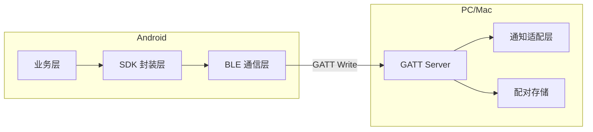
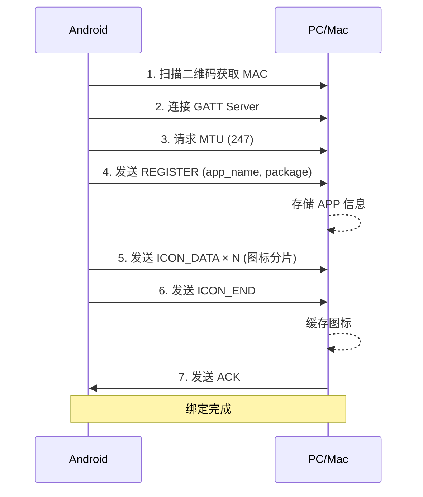
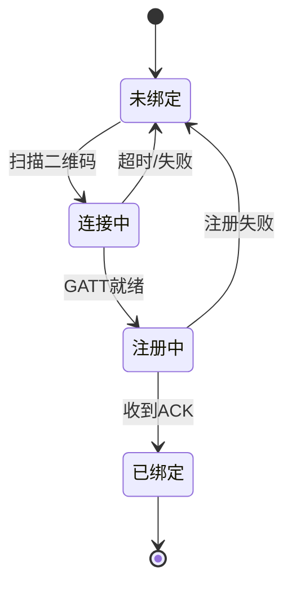
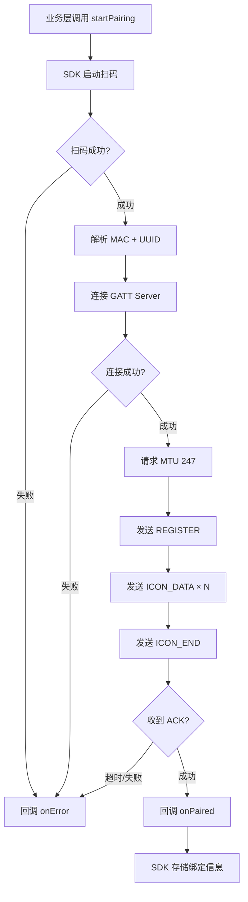
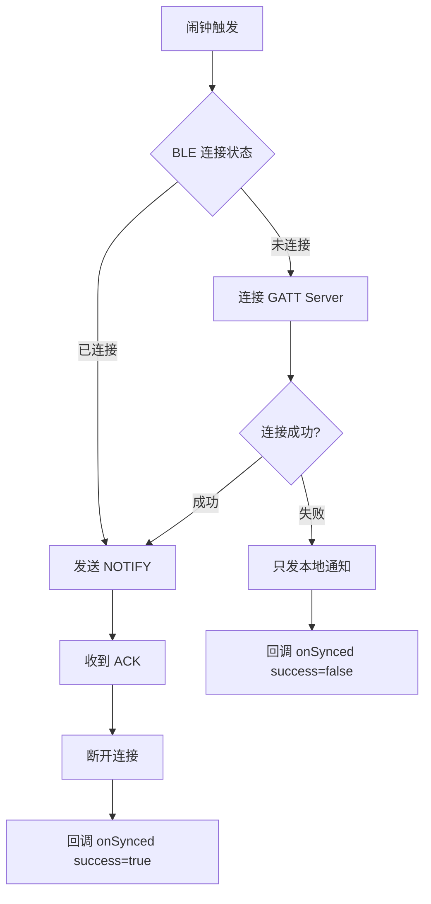

# BLE Notification Sync 设计文档

## 1. 项目概述

通过低功耗蓝牙（BLE）建立手机与电脑的近场直连通道，实现**零云端、零账号、纯本地**的闹钟通知同步。

- **Android 端（GATT Client）**：闹钟触发时推送通知到电脑
- **PC/Mac 端（GATT Server）**：接收数据后弹出系统原生通知

### 技术选型

| 平台 | 语言 | UI 框架 |
|------|------|---------|
| Android SDK | Kotlin | 无（纯 SDK） |
| Windows | C# / .NET 8 | WinForms + NotifyIcon |
| macOS | Swift | SwiftUI MenuBarExtra |

---

## 2. 通信协议

### 2.1 GATT 服务定义

| 项目 | 值 |
|------|-----|
| Service UUID | `0000A1B2-0000-1000-8000-00805F9B34FB` |
| Write Characteristic | `0000C3D4-0000-1000-8000-00805F9B34FB` |
| 属性 | WRITE_NO_RESPONSE |

### 2.2 数据帧格式

```
+--------+--------+--------+--------+-------------------+
| Magic  | MsgType| Seq    |TotalSeq| Payload           |
| 2B     | 1B     | 1B     | 1B     | 0~240B            |
| 0xAA 0xBB|      |        |        |                   |
+--------+--------+--------+--------+-------------------+
```

- **Magic**: 固定包头 `0xAA 0xBB`
- **MsgType**: 消息类型
- **Seq**: 当前包序号（0-based）
- **TotalSeq**: 总包数
- **Payload**: JSON 数据的字节流

### 2.3 消息类型

| 值 | 名称 | 方向 | 说明 |
|----|------|------|------|
| 0x01 | REGISTER | Android→PC | 绑定时发送 APP 信息 |
| 0x02 | NOTIFY | Android→PC | 推送通知 |
| 0x03 | ACK | PC→Android | 确认收到 |
| 0x04 | ICON_DATA | Android→PC | 图标分片数据 |
| 0x05 | ICON_END | Android→PC | 图标传输完成 |

### 2.4 Payload 格式

#### REGISTER

```json
{
  "app_name": "JustNow",
  "package": "com.nearby.justnow"
}
```

#### NOTIFY

```json
{
  "title": "任务提醒",
  "body": "会议还有10分钟",
  "package": "com.nearby.justnow",
  "timestamp": 1720000000000
}
```

#### ACK

```json
{
  "code": 0,
  "msg": "ok"
}
```

#### ICON_DATA

图标 Base64 分片，每片最大 240 字节。

#### ICON_END

```json
{
  "total_size": 12345
}
```

---

## 3. 系统架构

### 3.1 架构图



### 3.2 Android 端分层

| 层 | 职责 |
|----|------|
| 业务层 | 调用 SDK API |
| SDK 封装层 | setReminder / cancelReminder / sendNotification / startPairing |
| BLE 通信层 | MTU 协商、分片组包、串行队列、连接管理 |

### 3.3 PC/Mac 端分层

| 层 | 职责 |
|----|------|
| GATT Server | 广播服务、接收数据、重组分片 |
| 通知适配层 | 调用系统 API 弹出通知 |
| 配对存储 | 保存手机绑定信息、APP 图标缓存 |

---

## 4. 配对流程

### 4.1 二维码内容

```
ble://pair?mac=XX:XX:XX:XX:XX:XX&uuid=0000A1B2-0000-1000-8000-00805F9B34FB
```

### 4.2 配对时序图



### 4.3 配对状态机



### 4.4 配对流程图



---

## 5. SDK API 设计

### 5.1 配对 API

```kotlin
class BleNotificationSDK {
    // 开始配对
    fun startPairing(activity: Activity, callback: PairingCallback)

    // 查询绑定状态
    fun isPaired(): Boolean
    fun getPairedDevices(): List<PairedDevice>

    // 取消绑定
    fun unpair(deviceId: String)
}

interface PairingCallback {
    fun onScanSuccess(mac: String)
    fun onConnecting()
    fun onRegistering()
    fun onPaired()
    fun onError(error: PairingError)
}
```

### 5.2 闹钟 + 通知 API

```kotlin
class BleNotificationSDK {
    // 设置闹钟（闹钟触发时同时发本地通知 + 蓝牙推送）
    fun setReminder(
        taskId: String,
        title: String,
        body: String,
        triggerAt: Long,
        actions: List<ReminderAction> = emptyList(),
        callback: ReminderCallback? = null
    )

    // 取消闹钟
    fun cancelReminder(taskId: String)
}

data class ReminderAction(
    val label: String,
    val actionId: String
)

interface ReminderCallback {
    fun onScheduled(id: String)
    fun onTriggered(id: String)
    fun onSynced(id: String, success: Boolean)
}
```

### 5.3 直接发送 API

```kotlin
class BleNotificationSDK {
    // 直接发送通知（不走闹钟）
    fun sendNotification(
        title: String,
        body: String,
        callback: SendCallback? = null
    )
}

interface SendCallback {
    fun onSuccess()
    fun onError(error: SendError)
}
```

---

## 6. 连接策略

### 6.1 通知推送流程



### 6.2 连接策略

- **每次通知独立连接，用完即断**
- 不需要保活 Service
- 不需要前台 Service
- 连接耗时约 300ms - 1 秒

### 6.3 断线处理

| 场景 | 处理 |
|------|------|
| 连接失败 | 只发本地通知，回调 success=false |
| 发送超时 | 重试 3 次，失败则放弃 |
| PC 端不可用 | 连接失败，只发本地通知 |

---

## 7. PC/Mac 端设计

### 7.1 Windows 端

| 项目 | 技术选型 |
|------|----------|
| 语言 | C# / .NET 8 |
| UI | WinForms + NotifyIcon（系统托盘） |
| GATT Server | Windows.Devices.Bluetooth.GenericAttributeProfile |
| 广播 | BluetoothLEAdvertisementPublisher |
| 通知 | Microsoft.Toolkit.Uwp.Notifications (Toast) |

**核心模块**：

```
BleNotificationWin/
├── TrayApp.cs              # 托盘应用
├── GattServerService.cs    # GATT 服务
├── NotificationManager.cs  # 通知管理
├── PairingStorage.cs       # 配对存储
└── IconCache.cs            # 图标缓存
```

### 7.2 macOS 端

| 项目 | 技术选型 |
|------|----------|
| 语言 | Swift |
| UI | SwiftUI MenuBarExtra（菜单栏） |
| GATT Server | CoreBluetooth.CBPeripheralManager |
| 广播 | startAdvertising |
| 通知 | UserNotifications |

**核心模块**：

```
BleNotificationMac/
├── MenuBarApp.swift        # 菜单栏应用
├── PeripheralManager.swift # GATT 服务
├── NotificationService.swift # 通知服务
├── PairingStorage.swift    # 配对存储
└── IconCache.swift         # 图标缓存
```

---

## 8. 错误处理

### 8.1 BLE 连接异常

| 场景 | 处理策略 |
|------|----------|
| GATT 连接断开 | 重试 3 次，间隔 1s |
| MTU 协商失败 | 回退到默认 23 字节 |
| GATT_BUSY | 串行队列等待 |
| 发送超时 | 重试 3 次，失败回调 |

### 8.2 Android 端

| 场景 | 处理策略 |
|------|----------|
| 闹钟触发时 BLE 断开 | 尝试重连，失败则只发本地通知 |
| 扫码失败 | 回调 onError |
| 配对超时 | 回调 onError，状态回退 |

### 8.3 PC/Mac 端

| 场景 | 处理策略 |
|------|----------|
| 电脑睡眠 | GATT Server 断开，唤醒后自动重新广播 |
| 多手机绑定 | 支持，每个手机独立存储 |
| 图标传输中断 | 下次绑定时重新传输 |
| 通知权限未授权 | 首次启动引导授权 |

---

## 9. 测试策略

### 9.1 单元测试

| 模块 | 测试内容 |
|------|----------|
| 协议层 | 分片/重组、帧解析、消息类型编码 |
| SDK API | setReminder / cancelReminder 逻辑 |
| 配对解析 | 二维码 URL 解析 |

### 9.2 集成测试

| 场景 | 方法 |
|------|------|
| GATT 通信 | 模拟 GATT Server + 真实 Android 设备 |
| 通知弹出 | 验证 PC/Mac 端收到数据后正确弹出通知 |
| 分片传输 | 大数据（图标）完整传输验证 |

### 9.3 手动测试

| 场景 | 验证点 |
|------|--------|
| 首次配对 | 二维码扫描 → 绑定成功 |
| 通知推送 | 闹钟触发 → PC 收到通知 |
| 断线重连 | 关闭蓝牙 → 重新连接 |
| 多设备 | 两台手机绑定同一台电脑 |

---

## 10. 项目结构

```
BleNotificationSync/
├── android/              # Android SDK (Kotlin AAR)
│   ├── sdk/              # SDK 核心模块
│   ├── sample/           # 示例 App
│   └── build.gradle.kts
├── windows/              # Windows 端 (C# .NET)
│   ├── BleNotificationWin/
│   └── BleNotificationWin.sln
├── macos/                # macOS 端 (Swift)
│   ├── BleNotificationMac/
│   └── BleNotificationMac.xcodeproj
├── docs/                 # 文档
│   ├── protocol.md       # 协议规范
│   └── architecture.md   # 架构说明
├── examples/             # 集成示例
├── LICENSE
└── README.md
```

---

## 11. 实现阶段

| 阶段 | 内容 | 产出 |
|------|------|------|
| 1 | 协议规范文档 | docs/protocol.md |
| 2 | Windows 端实现 | 可运行的 GATT Server + 通知 |
| 3 | Android SDK 实现 | 可集成的 AAR 库 |
| 4 | macOS 端实现 | 可运行的 GATT Server + 通知 |
| 5 | 联调测试 | 三端互通验证 |
