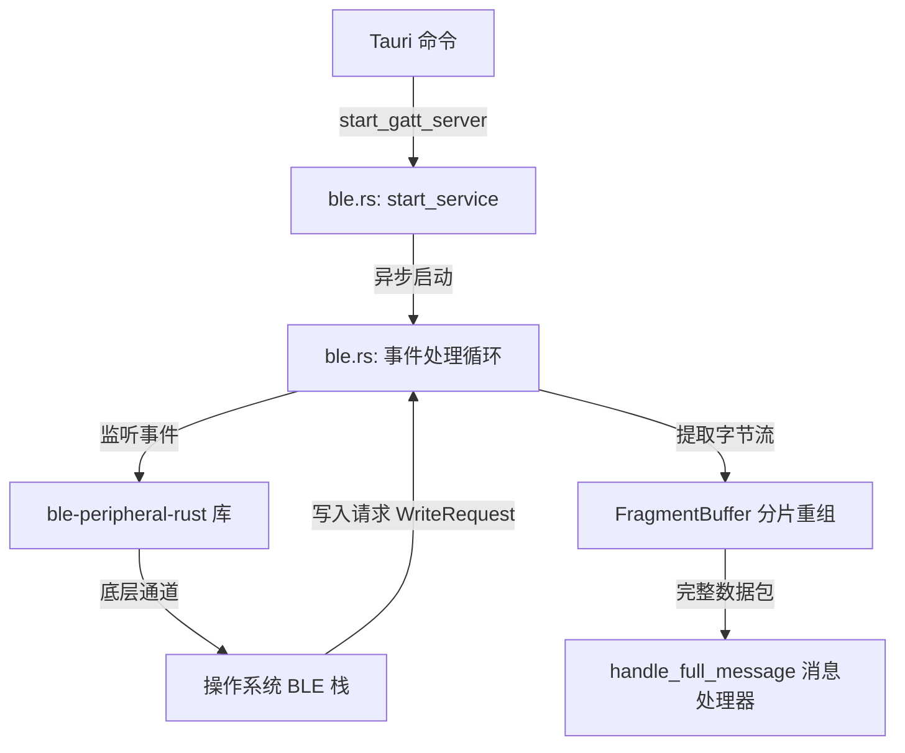

# 设计文档: 跨平台 BLE 外设（Peripheral）服务设计（Windows & macOS）

## 1. 目标
将当前 [ble_winrt.rs](file:///home/lanef/Android/MultiPlatformProjects/BleNotificationSync/desktop/src-tauri/src/ble_winrt.rs) 中用于排查的 Windows 特定 WinRT 实现，重构为在 [ble.rs](file:///home/lanef/Android/MultiPlatformProjects/BleNotificationSync/desktop/src-tauri/src/ble.rs) 中使用 [ble-peripheral-rust](https://crates.io/crates/ble-peripheral-rust) 库的统一跨平台（Windows 和 macOS）实现。这能解决 Windows 下 `Pub Start` 广播参数错误，并为后续适配 macOS 奠定基础。

## 2. 背景与根本原因分析
在对 Windows WinRT 原生代码进行测试时，程序在启动 BLE 服务时报错：
`BLE 启动失败: Pub Start: 参数错误。 (0x80070057)`

**原因分析**：
该错误是由以下两者的重复调用冲突导致的：
1. `BluetoothLEAdvertisementPublisher`（由于默认的可连接属性等限制，手动启动时报参数错误失败）。
2. `GattServiceProvider`（在将 `IsDiscoverable` 和 `IsConnectable` 设为 `true` 启动广告时，系统底层已自动发布服务 UUID）。

通过直接迁移至跨平台库 `ble-peripheral-rust`，该库会在底层为不同平台正确处理 BLE 外设逻辑（Windows 下调用 `GattServiceProvider` 广告接口，macOS 下调用 `CBPeripheralManager`），不会引入双重广播逻辑。

## 3. 架构与代码设计

重构后的后端 BLE 架构流程如下：



### 3.1 依赖关系
在 [Cargo.toml](file:///home/lanef/Android/MultiPlatformProjects/BleNotificationSync/desktop/src-tauri/Cargo.toml) 中确保引入并激活以下包：
- `ble-peripheral-rust = "0.2"`
- `uuid = "1"`

我们暂时保留 Cargo.toml 中的其他平台依赖，不做无用重构。

### 3.2 状态管理与生命周期 [ble.rs](file:///home/lanef/Android/MultiPlatformProjects/BleNotificationSync/desktop/src-tauri/src/ble.rs)
为了支持服务的优雅停止并避免生命周期泄漏，在 `BleState` 中引入 `oneshot::Sender`：

```rust
pub struct BleState {
    pub is_running: std::sync::Mutex<bool>,
    pub shutdown_tx: std::sync::Mutex<Option<tokio::sync::oneshot::Sender<()>>>,
}
```

### 3.3 BLE 外设启动与停止时序
1. **初始化外设**：调用 `Peripheral::new(event_tx)` 获得外设句柄。
2. **定义服务与特征值**：
   - 注册主服务 UUID 为 `9e1d51a4-9c86-4447-9759-f6222b0f4b36`。
   - 注册写入特征值 UUID 为 `f4788cde-8025-4c07-b352-87db1b272fdf`，属性为 `Write` + `WriteWithoutResponse`。
3. **注册与广告**：通过 `peripheral.add_service(&service)` 注册服务，并调用 `peripheral.start_advertising("BleSyncPC", &[service_uuid])` 开启广播。
4. **事件消费**：异步轮询 `PeripheralEvent`：
   - 收到 `WriteRequest` 后：先 `catch_unwind` 回复成功（防范 WinRT COM 异常），提取 value 字节 → `protocol::parse_frame` → `FragmentBuffer::insert`（带 30s 超时清理），重组成功 → `handle_full_message` 分发到 REGISTER/NOTIFY/ICON_DATA/ICON_END 处理器。
   - 收到 `ReadRequest` 后：直接回复成功。
5. **服务关闭**：当调用 `stop_service` 时，触发 `shutdown_tx` 发送信号，退出事件循环，丢弃 `Peripheral` 实例以释放蓝牙广播。

## 4. 演进记录（与原设计的差异）
- 服务 UUID 和特征值 UUID 使用自定义值（非标准 128-bit UUID），与原始方案不同
- 特征值同时支持 `Write` 和 `WriteWithoutResponse`（非仅 WRITE_NO_RESPONSE）
- `FragmentBuffer` 增加 `created_at` 时间戳 + `cleanup_stale()` 防丢包内存泄漏
- `WriteRequest` 响应增加 `catch_unwind` 防 WinRT COM 异常崩溃
- 消息处理器扩展支持 ICON_DATA/ICON_END（图标同步）
- 桌面端新增 `config.rs`（图标存储/keyring 密钥管理）、`notify.rs`（NotifyState 通知清理防抖）、`event_handler.rs`（托盘菜单事件）模块
